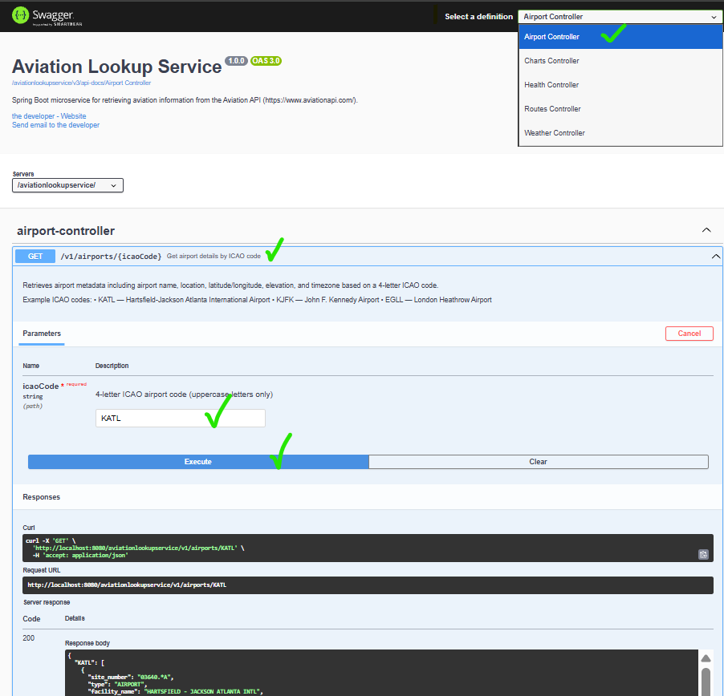
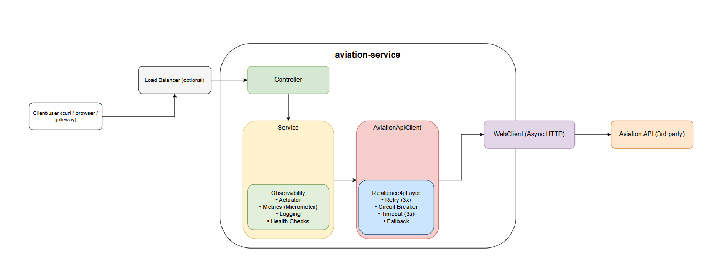
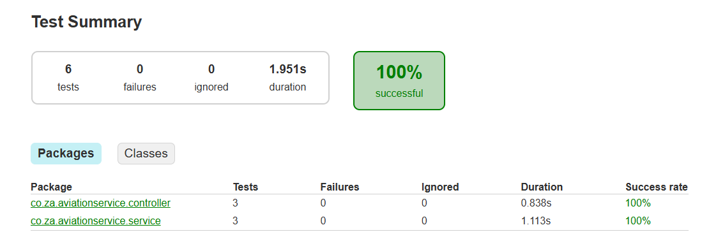
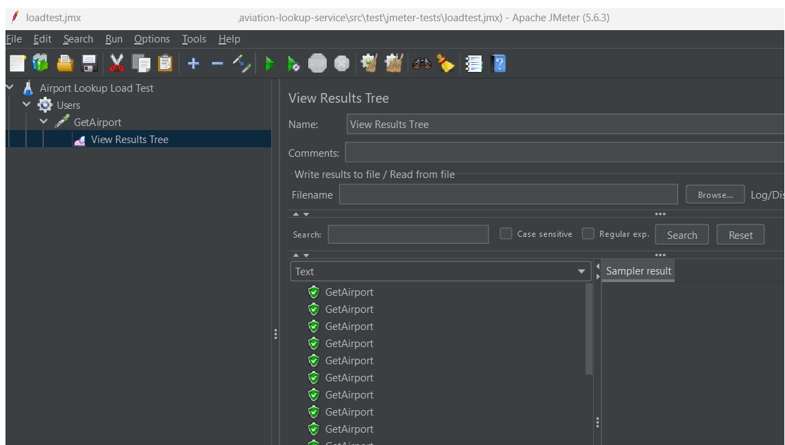
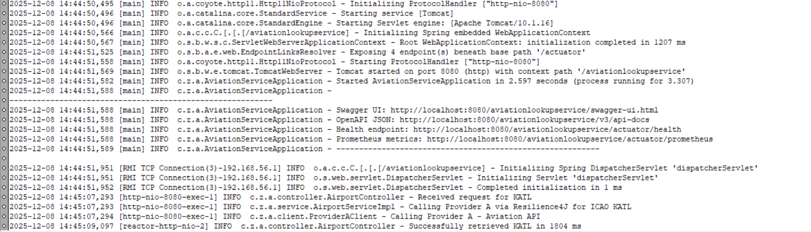

# Aviation Lookup Service
This is a Spring Boot microservice for retrieving aviation information from the Aviation API.
(**Mainly** : retrieving airport information using ICAO codes from the Aviation API. as per assessment request)


### Setup and run instructions
✔ Go to frontend project folder: `cd aviation-lookup-service` \

✔ Build the project: `./gradlew clean build` \

✔ Run the application: `./gradlew bootRun` \

## Endpoints
Below endpoints should be accessible.
```
Swagger UI		: http://localhost:8080/aviationlookupservice/swagger-ui.html
OpenAPI JSON		: http://localhost:8080/aviationlookupservice/v3/api-docs
Health endpoint		: http://localhost:8080/aviationlookupservice/actuator/health
Prometheus metrics	: http://localhost:8080/aviationlookupservice/actuator/prometheus
```



### Technology Stack:
✔Java 17 \
✔Spring Boot (for REST API) \
✔Gradle (build tool) \
✔OpenAPI/Swagger (API documentation) \
✔JMeter (.jmx) for load testing \
✔Docker (containerization) \
✔Resilience libraries: Resilience4j (circuit breakers, retries) \
✔Logging: SLF4J + Logback (logging api timer to see performance) \
✔Metrics: Micrometer + Prometheus (optional)


## Architecture Overview


## AviationAPI documentation
- Airports : https://docs.aviationapi.com/#tag/airports
- Example: https://api.aviationapi.com/v1/airports?apt=KATL

## Architecture Decisions

### 1. **Layered Architecture**
- **Controller Layer**: HTTP request handling and validation
- **Service Layer**: Business logic and orchestration
- **Client Layer**: External API integration with resilience patterns
- **Clean separation** enables independent testing and scaling

### 2. **Resilience Patterns**
- **Circuit Breaker**: Prevents cascading failures (50% threshold, 30s recovery)
- **Retry Logic**: 3 attempts with exponential backoff (2s base)
- **Rate Limiting**: 100 requests/minute to protect upstream API
- **Timeouts**: 5s connection/read timeouts
- **Fallback**: Returns cached/default data when circuit opens

### 3. **Scalability Features**
- **Stateless design**: No session state, horizontally scalable
- **Reactive WebClient**: Non-blocking I/O for better resource utilization
- **Connection pooling**: Efficient HTTP connection management
- **Graceful shutdown**: 30s drain period for in-flight requests

### 4. **Observability**
- **Structured logging**: SLF4J + logback.xml with contextual information
- **Metrics**: Prometheus-compatible metrics via Actuator
- **Health checks**: Liveness/readiness probes

### 5. **Security**
- **Input validation**: ICAO code format validation
- **Non-root container**: Docker runs as unprivileged user
- **Error sanitization**: No sensitive data in error responses


## Unit/Integration test



## Performance test (using JMeter)
- **Jmeter file [/aviation-lookup-service/src/test/jmeter-tests/loadtest.jmx]**: import 'loadtest.jmx' file on jmeter



## Logs monitoring
- Logs will be found on directory : /opt/logs/aviation-lookup-service.log



**Clone the repository**
```bash
git clone https://github.com/typear247/aviation-service
cd aviation-service